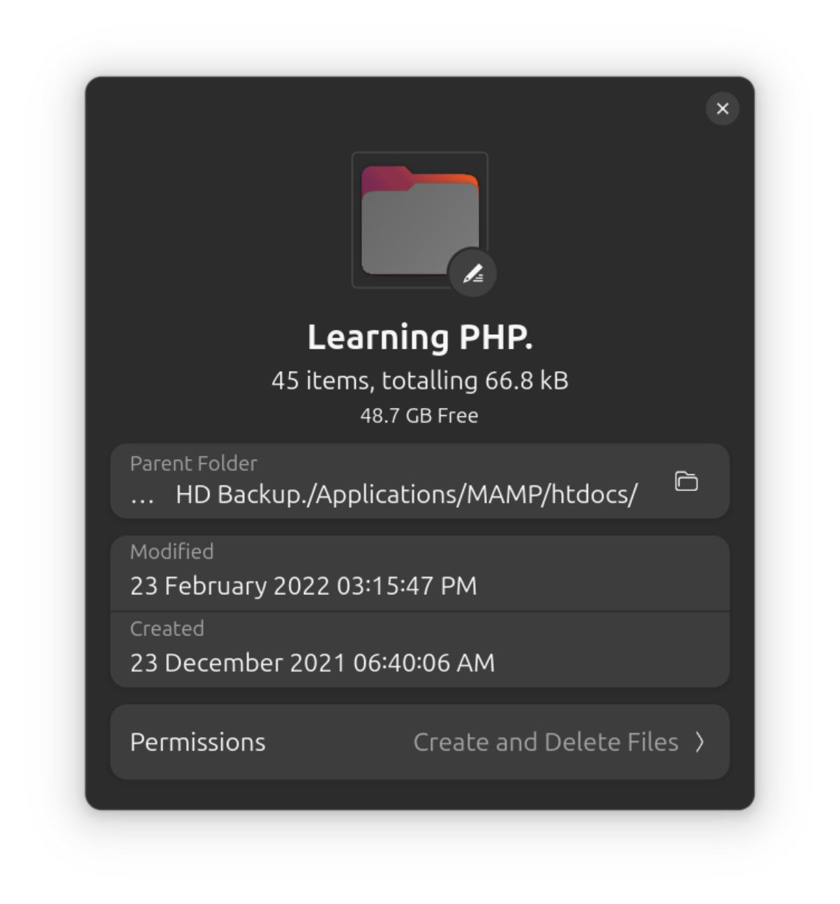

# Learning PHP Repository  

This repository contains a collection of PHP scripts and projects I created while learning PHP using tutorial videos by **Dani Krossing** on YouTube. It documents my journey to understand and master PHP programming, covering both foundational concepts and practical applications. A wide range of topics were covered, including:

- PHP basics like variables, operators, and control structures.  
- Advanced concepts like session management, database interaction, and error handling.  
- Practical applications, such as login systems, contact forms, and image galleries.

Created and completed between 23rd Dec 2021 and 23rd Feb 2022.

## Repository Overview  

### Purpose

This repository serves as a practice ground for implementing the concepts demonstrated in the tutorial videos. Each file corresponds to a specific episode from Dani Krossing’s tutorial series. The numbering of each file reflects the tutorial episode, so there are no missing files—each file directly maps to a lesson taught in the series.  

## Contents  

### Folders

1. **Connecting to DB (36 to 40)**: Database connection techniques using PHP.  
2. **Error Handling (41, 42)**: Implementations of error handling approaches.  
3. **Uploading (51)**: Examples of handling file uploads in PHP.  
4. **Delete Profile Image (52, 53)**: Functions to delete profile images from the server.  
5. **Delete Folder Files (54, 55)**: Scripts for deleting files within folders.  
6. **Search Field (57)**: Demonstrations of building search functionalities.  
7. **Contact Form (58)**: A simple contact form implementation.  
8. **PHP Gallery (63)**: A project to create an image gallery with PHP.  
9. **db_backup**: Backup files for database operations.  
10. **Functions**: User-defined and built-in PHP functions.  
11. **The Login System**: Implementation of a basic login system.  

### Files

- **03.variables.php to 13.ifElseIf.php**: Cover foundational concepts like variables, data types, loops, operators, and conditional statements.  
- **14.switchStatement.php**: Demonstrates `switch` statement functionality.  
- **15.buildingACalculator.php**: A calculator built using PHP.  
- **16.scheduledMessage.php**: A script for handling scheduled messages.  
- **19.forLoop.php to 21.arrays.php**: Iterative structures and array manipulation examples.  
- **22.userDefinedFunction.php**: Demonstrates user-defined functions.  
- **23.header.php**: Example usage of the `header()` function.  
- **27.cookies&sessions.php to 28.session_index.php**: Session and cookie management scripts.  
- **29 to 35 MySQL Database Manipulations.php**: Database operations using PHP and MySQL.  
- **43.hashingAndDehashing.php**: Security implementations with hashing and dehashing techniques.  

### Additional Files

- **.htaccess**: Configuration file for server behavior.  
- **SandBox.php and SandBox.txt**: Experimental files for testing concepts and code snippets.

## Highlights  

- Each file is numbered to match its corresponding tutorial episode, making it easy to follow along.  
- Comprehensive coverage of PHP topics, serving as both a learning archive and a reference guide.  
- Real-world applications demonstrated through projects like contact forms, login systems, and file uploads.  

## Screenshots

Here's a screenshots of the project folder properties:

## License

This repository is shared without any specific license, as it primarily serves as an educational archive.
